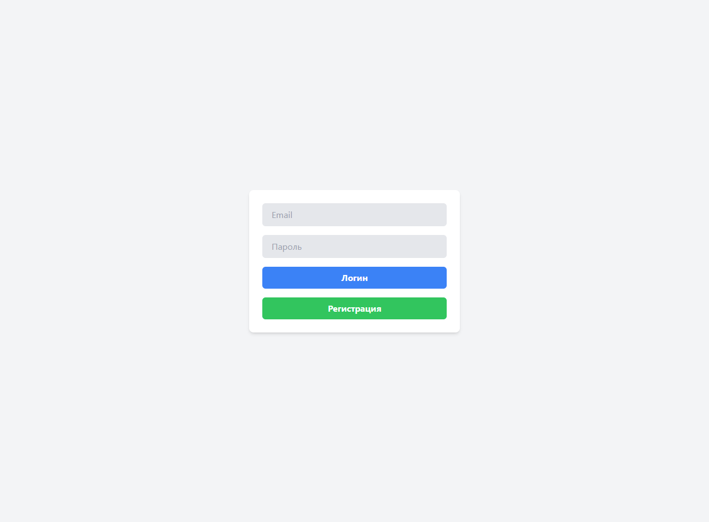
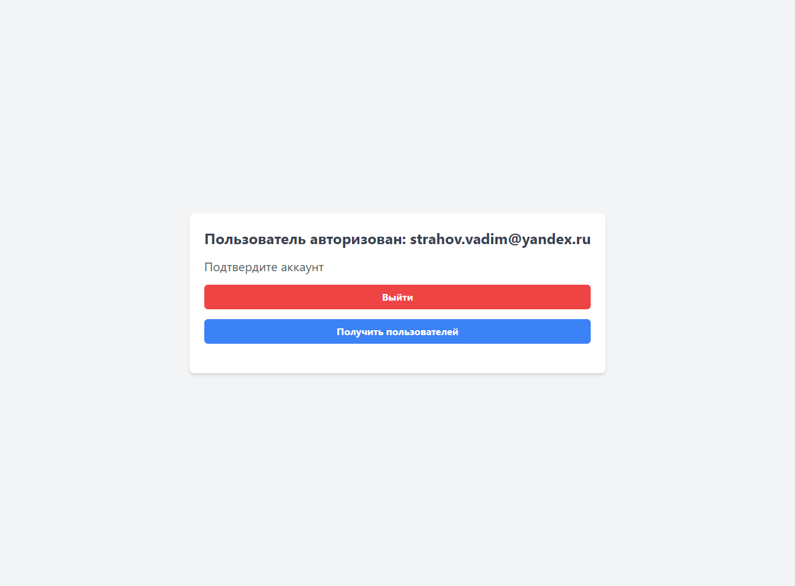
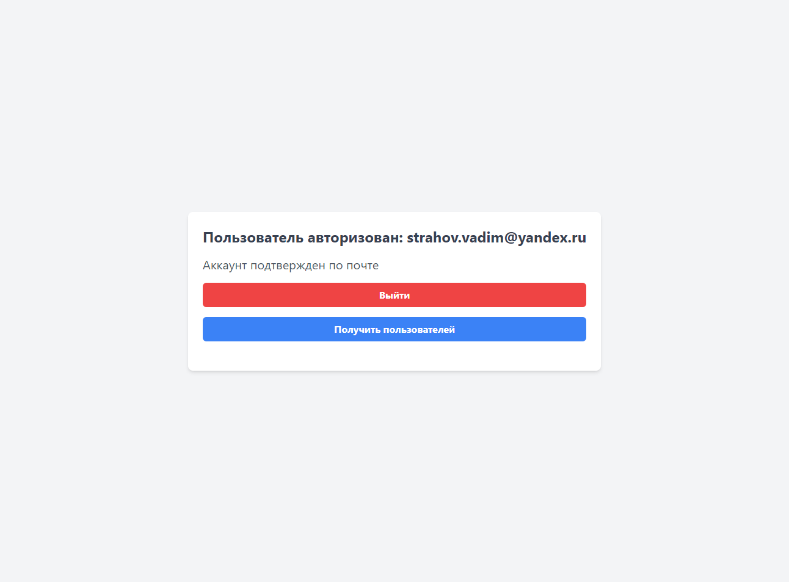

## Fullstack авторизация

- ### В проекте создана серверная и клиентская часть
- ### Реализована регистрация и авторизация пользователя по jwt токену, настроена отправка писем при регистрации через nodemailer, активация по почте, подключена база данных mongodb, реализована работа с состоянием на клиенте через mobx
- ### Технологии - `react`, `express`, `typescript`, `mongodb`, `mobx`, `mongoose`, `axios`, `jsonwebtoken`, `nodemailer`, `tailwindcss`

